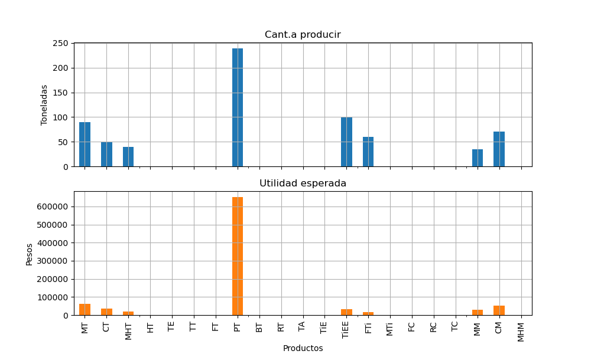
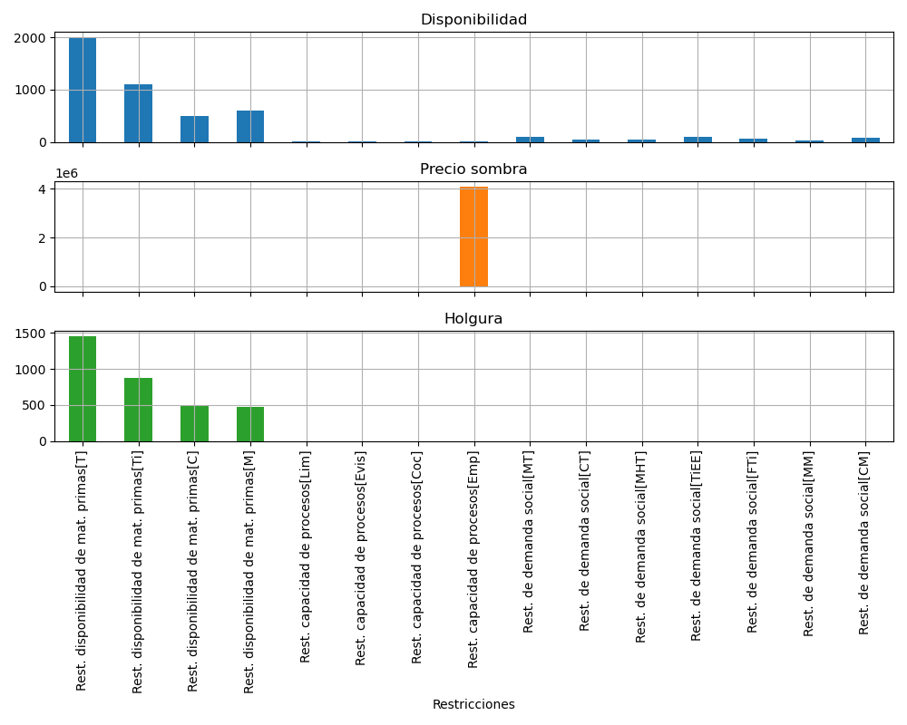

# Optimización de la Planificación de Producción con Programación Lineal

Este repositorio contiene una implementación en Python del modelo de programación lineal propuesto en el artículo científico **"Planificación productiva del procesamiento pesquero en Santiago de Cuba mediante programación lineal"**. Este proyecto tiene como objetivo optimizar la planificación de la producción en un entorno industrial, maximizando las utilidades operativas mientras se cumplen restricciones productivas, económicas y sociales.

## Contexto

En la industria de procesamiento pesquero de Santiago de Cuba, la planificación de la producción enfrenta múltiples desafíos debido a limitaciones en la disponibilidad de materias primas, capacidades productivas y restricciones sociales. Este proyecto es un ejemplo de implementacion del estudio original donde se desarrolla y aplica un modelo de programación lineal para abordar estos retos, permitiendo:

- Determinar las materias primas y productos más rentables.
- Mejorar el uso de los recursos productivos.
- Cumplir con objetivos sociales y económicos de manera simultánea.

> **Nota:** Aunque este modelo está basado en el artículo, los datos utilizados aquí son ficticios y no corresponden a los datos reales de la publicación. También se emplea gurobipy junto al solver de Gurobi, en vez de pyomo y el solver CBC como en la publicación original.

---

## Características del Proyecto

- **Modelo Matemático:** Implementación del modelo de programación lineal en Python utilizando la biblioteca `gurobipy`.
- **Solución Optimizada:** Resolución del modelo con el solver Gurobi Optimizer version 12.0.0.
- **Flexibilidad:** Adaptable a diferentes escenarios industriales.
- **Resultados Visuales:** Análisis y visualización de los resultados para interpretar la utilidad generada y el uso de materias primas.

---

## Estructura del Repositorio

```
├── analysis.ipynb # Notebook con análisis detallado
├── results/
│   └── outputs/ # Resultados generados por el modelo
├── docs/
│   └── articulo.pdf # Artículo original
├── LICENSE
└── README.md
└── requirements.txt
```

---

## Instalación

### Pre-requisitos

- Python 3.8+
- Librerías necesarias (incluidas en `requirements.txt`):
  - `guropy`
  - `matplotlib`
  - `numpy`
  - `pandas`

Instala las dependencias ejecutando:

```bash
pip install -r requirements.txt
```

### Ejecución del Proyecto

1. Clona este repositorio:

   ```bash
   git clone https://github.com/jfrometa88/Optimizaci-n-de-la-Planificaci-n-de-Producci-n-con-Programaci-n-Lineal.git
   ```

3. Abre el notebook en la carpeta `notebooks/` para un análisis más detallado:

   ```bash
   jupyter notebook notebooks/analysis.ipynb
   ```

---

## Modelo Matemático

### Conjuntos e índices

$i \in \text{Productos}=\{\text{MT},\text{CT},\text{MHT},\text{...},\text{MHM}\}$: Conjunto de productos.

$j \in \text{Materias Primas}=\{\text{T},\text{Ti},\text{C},\text{M}\}$: Conjunto de Materias primas.

$k \in \text{Procesos}=\{\text{Lim},\text{Evis},\text{Coc},\text{Emp}\}$: Conjunto de procesos.

$s \in \text{Productos con demanda social}=\{\text{MT},\text{CT},\text{MHT},\text{...},\text{CM}\}$: Conjunto de productos con demanda social ($s \subseteq i$).

### Parámetros

$\text{Utilidad}_{i} \in \mathbb{R}^+$: Utilidad marginal esperada en pesos por cada tonelada fabricada de producto $i$.

$\text{Consumo}_{i,j} \in \mathbb{R}^+$: Coeficiente técnico de norma de consumo de toneladas de materia prima $j$ por cada tonelada de producto $i$ fabricada.

$\text{Disponibilidad}_{j} \in \mathbb{R}^+$: Disponibilidad de la materias prima $j$ en el mes.

$\text{Capacidad}_{i,k} \in \mathbb{R}^+$: Coeficiente técnico de capacidad instalada de toneladas del producto $i$ a fabricar en un mes por cada proceso $k$.

$\text{Uso}_{k} \in (0,1)$: Coeficiente de aprovechamiento de la capacidad instalada de cada proceso $k$ en el mes (valores entre 0 y 1).

$\text{Minimo}_{s} \in \mathbb{R}^+$: Demanda mínima a satisfacer del producto $s$ con destino social.

### Variables de decision

$\text{Producción}_{i} \in \mathbb{R}^+$: Cantidad de toneladas a producir en el mes del producto $i$.

### Función Objetivo

Maximizar la utilidad operativa:

$Z = sum_{i} (Utilidad_{i} \cdot Producción_{i})$

### Restricciones

1. **Disponibilidad de materias primas:**
   $\sum_{i} (Consumo_{i,j} \cdot Producción_{i}) \leq Disponibilidad_{j}$

2. **Capacidades productivas:**
   $Producción_{i} \leq Capacidad_{i,k} \cdot Uso_{k}$

3. **Producción mínima para fines sociales:**
   $Producción_{s} \geq Minimo_{s} $

4. **No negatividad:**
   $Producción_{i} \geq 0$

---

## Ejemplo de Resultados

Los resultados incluyen:

- **Visualización de Resultados:**
  

  


---

## Referencia Científica

Frómeta-Moya, J. I., & Labrada-Díaz, T. (2023). *Planificación productiva del procesamiento pesquero en Santiago de Cuba mediante programación lineal*. Revista Ingeniería Industrial, 44(1), 1-14.

---

## Contribuciones

Este proyecto está abierto a contribuciones. Si tienes sugerencias o mejoras, por favor abre un issue o envía un pull request.

---

## Licencia

Este proyecto está licenciado bajo la Licencia MIT. Consulta el archivo `LICENSE` para más detalles.


```python

```


